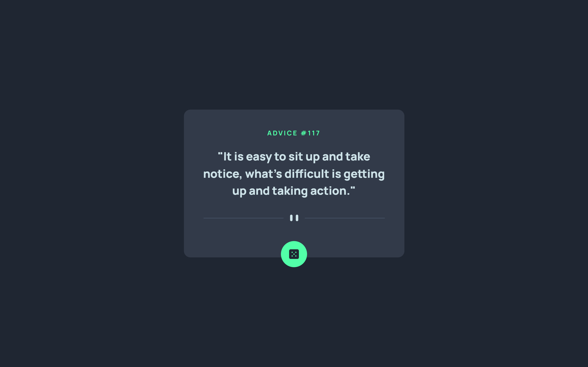

# Frontend Mentor - Advice generator app solution

This is a solution to the [Advice generator app challenge on Frontend Mentor](https://www.frontendmentor.io/challenges/advice-generator-app-QdUG-13db). Frontend Mentor challenges help you improve your coding skills by building realistic projects.

## Table of contents

- [Overview](#overview)
  - [The challenge](#the-challenge)
  - [Screenshot](#screenshot)
  - [Links](#links)
- [My process](#my-process)
  - [Built with](#built-with)
  - [What I learned](#what-i-learned)
  - [Continued development](#continued-development)
  - [Useful resources](#useful-resources)
- [Author](#author)

## Overview

### The challenge

Users should be able to:

- View the optimal layout for the app depending on their device's screen size
- See hover states for all interactive elements on the page
- Generate a new piece of advice by clicking the dice icon

### Screenshot



### Links

- [Solution](https://your-solution-url.com)
- [Live Site](https://your-live-site-url.com)

## My process

### Built with

- Semantic HTML5 markup
- CSS custom properties
- Flexbox
- CSS Grid
- Mobile-first workflow

### What I learned

Kept it pretty simple this project, the main focus here was using API's.
Although I've worked with them in the past, this project gave me a refresher, and a further understanding on the subject.

```js
function generateAdvice() {
    fetch("https://api.adviceslip.com/advice")
      .then((response) => {...})}
```

### Continued development

Simply excited to step further into javascript as well as more complex desing layouts. On this project I took the most vanilla approach. In the future after a better grasp on the concepts I'd like to making more use of frameworks.

### Useful resources

- [Example resource 1: Load Function](https://developer.mozilla.org/en-US/docs/Web/API/Window/load_event) - Laying out a load function, and its purpose.
- [Example resource 2: API ](https://www.freecodecamp.org/news/make-api-calls-in-javascript/) - Understanding how to connect, and use the sections.

## Author

- My Website (coming soon...)
- Frontend Mentor - [@moncadad](https://www.frontendmentor.io/profile/moncadad)
